<p align="center">
  
</p>

<h1 align="center">Motion Graphics Skill Pack</h1>

<p align="center">
  <strong>15 skills for directing and building professional motion graphics with Claude Code. Every frame is code.</strong>
</p>

<p align="center">
  <a href="https://github.com/imMamdouhaboammar/motion-graphics-skills/stargazers"></a>
  
  
  <a href="LICENSE"></a>
  <a href="https://github.com/imMamdouhaboammar"></a>
<p align="center">
  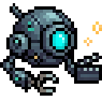&nbsp;&nbsp;&nbsp;&nbsp;&nbsp;&nbsp;
  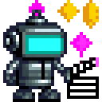&nbsp;&nbsp;&nbsp;&nbsp;&nbsp;&nbsp;
  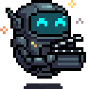
</p>

<p align="center">
  <a href="https://immamdouhaboammar.github.io/motion-graphics-skills/">Website</a> &nbsp;·&nbsp;
  <a href="#install">Install</a> &nbsp;·&nbsp;
  <a href="#see-it-work">See it work</a> &nbsp;·&nbsp;
  <a href="#the-skills">The skills</a> &nbsp;·&nbsp;
  <a href="#how-they-fit-together">How they fit</a> &nbsp;·&nbsp;
  <a href="#meet-the-director-crew">The Fleet</a> &nbsp;·&nbsp;
  <a href="#prompts">Prompts</a> &nbsp;·&nbsp;
  <a href="https://github.com/imMamdouhaboammar">Author</a>
</p>

---

This pack directs and builds code-driven motion graphics without requiring After Effects. It covers brand films, event promos, explainers, kinetic typography, editorial collage, charts, title sequences, product launches, 2D, 2.5D and true 3D. Claude Code or Codex can author the composition, while HyperFrames can provide the reusable runtime, validation, preview, audio and rendering layers instead of rebuilding them.

## Install

One line, about 30 seconds:

```bash
npx skills add imMamdouhaboammar/motion-graphics-skills
```

Then open Claude Code, pick Opus 5.5 with `/model`, and run `brand-intake` first.

<details>
<summary><strong>Manual copy into Claude Code</strong></summary>

Download this repo (green **Code** button, then **Download ZIP**) and unzip it, or clone it:

```bash
git clone https://github.com/imMamdouhaboammar/motion-graphics-skills.git
```

Copy the 15 folders inside `skills/` into `~/.claude/skills/` (every project) or your project's `.claude/skills/` (one project). This loop keeps any skill folder you already have:

```bash
mkdir -p ~/.claude/skills
for skill in motion-graphics-skills/skills/*; do
  [ -f "$skill/SKILL.md" ] || continue
  destination="$HOME/.claude/skills/$(basename "$skill")"
  if [ -e "$destination" ]; then
    printf 'Preserved existing skill: %s\n' "$destination"
  else
    cp -R "$skill" "$destination"
  fi
done
```

</details>

<details>
<summary><strong>Claude Desktop (upload one skill)</strong></summary>

Zip one skill folder and upload it in Customise, then Skills. From `motion-graphics-skills/skills`:

```bash
zip -r brand-intake.skill brand-intake
```

Start with `brand-intake`, then add the skills you need.

</details>

<details>
<summary><strong>Codex</strong></summary>

From your project's root, after cloning this repo into it:

```bash
test -d motion-graphics-skills/skills || { printf 'Missing source skills folder\n'; exit 1; }
mkdir -p .agents/skills || exit 1
for skill in motion-graphics-skills/skills/*; do
  [ -f "$skill/SKILL.md" ] || continue
  name="$(basename "$skill")"
  destination=".agents/skills/$name"
  if [ -e "$destination" ] || [ -L "$destination" ]; then
    printf 'Preserved existing skill: %s\n' "$destination"
  else
    cp -R "$skill" "$destination" || exit 1
  fi
done
```

Open a fresh Codex task and check the skills load from `.agents/skills/<name>/SKILL.md`.

</details>

<details>
<summary><strong>Export to MP4</strong></summary>

Add HyperFrames once (free, open source): `npx skills add heygen-com/hyperframes`. Or use the included [Animation Export Kit](tools/animation-export-kit) to turn any of these HTML files into an MP4 (Mac and Windows).

</details>

## See it work

<table>
  <tr>
    <td width="50%" valign="top" align="center">
      <h3>TEOLA Product Launch</h3>
      <a href="https://github.com/imMamdouhaboammar/motion-graphics-skills/blob/main/TEOLA-ad.mp4">
        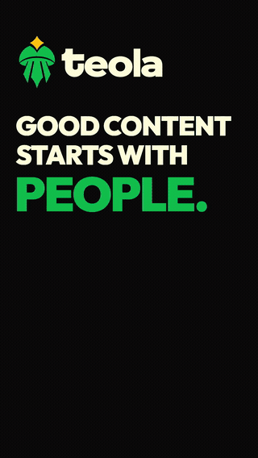
      </a>
      <p align="center">
        <a href="https://github.com/imMamdouhaboammar/motion-graphics-skills/blob/main/TEOLA-ad.mp4">▶ Play Full Video (TEOLA-ad.mp4)</a>
      </p>
      <p align="left"><sub>Full product launch commercial built completely with code and motion direction. Deep blue glass, glow transitions, and every word from an approved fact list.</sub></p>
    </td>
    <td width="50%" valign="top" align="center">
      <h3>Four Steps Events Motion Final</h3>
      <a href="https://github.com/imMamdouhaboammar/motion-graphics-skills/blob/main/projects/four-steps-events/renders/Four-Steps-Events-Motion-Final-v2.mp4">
        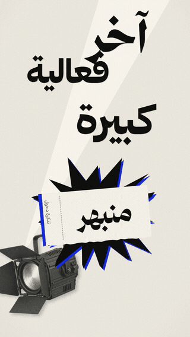
      </a>
      <p align="center">
        <a href="https://github.com/imMamdouhaboammar/motion-graphics-skills/blob/main/projects/four-steps-events/renders/Four-Steps-Events-Motion-Final-v2.mp4">▶ Play Full Video (Four-Steps-Events-Motion-Final-v2.mp4)</a>
      </p>
      <p align="left"><sub>Bilingual event promo with Arabic typography, custom brand cutouts, synchronized voiceover, and kinetic typography.</sub></p>
    </td>
  </tr>
</table>

### Start here: one line, 60 seconds

<table>
  <tr>
    <td width="96" align="center" valign="middle">
      <br>
      <sub><strong>Motion Director</strong></sub>
    </td>
    <td>
      <p>Before touching any specialist skill, paste this into Claude Code (Opus 5.5) or Codex:</p>
      <pre><code>Make a dynamic 15-second motion graphics video that shows what an incredible motion designer you are. Go all out.</code></pre>
      <p>Then direct the cut like a lead designer giving real notes:</p>
      <ul>
        <li><em>"Slow down the second scene."</em></li>
        <li><em>"Swap the text for mine: [your words]."</em></li>
        <li><em>"Use my brand colours: [hex codes]."</em></li>
        <li><em>"Make it 1080 x 1350 for LinkedIn."</em></li>
      </ul>
    </td>
  </tr>
</table>

When you want a specific job done properly, pick a skill below.

## The skills

Fifteen skills, with motion-director as the broad creative front door. Type the line on the right into Claude Code and the right skill picks it up.

| Stage | Skill | What you get | Say this |
|---|---|---|---|
|  Direct | [**motion-director**](skills/motion-director/) | Master creative direction, concept, craft, HyperFrames routing, review, and production for broad motion work. | "Direct this motion film from reference to final render." |
|  Mix | [**mix-and-match**](skills/mix-and-match/) | Cross-pollinates multiple references into an original concept direction with wildcard discovery and creative-distance checks. | "Mix these references into one original direction." |
| 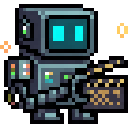 Set up | [**brand-intake**](skills/brand-intake/) | Builds brand.md and MOTION.md. Every other skill reads them first. | "Set up my brand for motion. Here are five frames I like." |
| 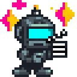 Plan | [**motion-brief-writer**](skills/motion-brief-writer/) | Turns a rough idea into a precise build brief in your brand. | "Write me a motion brief for my next milestone post." |
| 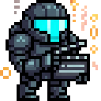 Launch | [**launch-video**](skills/launch-video/) | A 30 to 45 second launch for a product, offer or cohort. | "Make a launch video for my new cohort." |
| 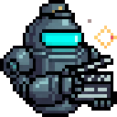 Launch | [**apple-launch-film**](skills/apple-launch-film/) | A Mac-style launch film. Menu bar, notch and widgets, all code. | "Make it look like an Apple keynote launch." |
|  Explain | [**vox-explainer**](skills/vox-explainer/) | A 30 to 60 second documentary explainer. | "Make a Vox-style video: why do we dream?" |
| 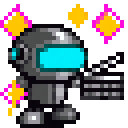 Explain | [**animated-chart**](skills/animated-chart/) | A looping chart. Every value stays exactly as you give it. | "Animate my chart. Here are my numbers." |
| 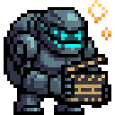 Explain | [**milestone-reveal**](skills/milestone-reveal/) | A night sky of points that pulls into your real number. | "Make a milestone video for my follower count." |
| 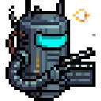 Explain | [**motion-effects**](skills/motion-effects/) | 16 premium effects in your brand, as 8-second loops. | "Build the search-to-results effect in my brand." |
| 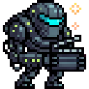 Open | [**title-sequence-3d**](skills/title-sequence-3d/) | An 8 to 15 second 3D opener that stops the scroll. | "Make a cinematic 3D intro for my next video." |
| 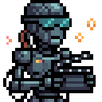 Compare | [**model-showdown**](skills/model-showdown/) | One brief, three AI models, stacked into one video. | "Same prompt, three AIs. Make a model showdown." |
|  Promote | [**newsletter-promo**](skills/newsletter-promo/) | A 12 to 20 second promo that sends people to an edition. | "Make a promo for this week’s newsletter." |
|  Promote | [**loop-cover**](skills/loop-cover/) | Your newsletter cover as a seamless looping GIF. | "Make my newsletter cover a looping GIF." |
|  Promote | [**reel-export**](skills/reel-export/) | Any video as a clean 1080 x 1920 Reel or TikTok. | "Make this a reel for Instagram." |

See each skill's `SKILL.md` for its trigger phrases, the inputs it asks for and what it learned the hard way.

## How they fit together

Use `motion-director` for broad motion work and `brand-intake` once per brand. `brand-intake` writes `brand.md` (who you are, what you sell, your assets) and `MOTION.md` (your colours, type, timing and motion rules), and adds a rule to CLAUDE.md so Claude reads both before it animates anything. Every other skill reads those two files first. Without them, a skill asks for your hex codes, font and logo, and never calls its result on-brand.

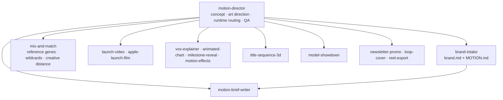

## Use it

For broad motion work, start with `motion-director`. Run `brand-intake` once per brand when brand.md and MOTION.md do not already exist. Narrow requests can route directly to a specialist:

```
"Direct this motion film" → motion-director\n"Review this motion cut by timecode" → motion-director\n"Set up my brand" → brand-intake
"Brief this animation" → motion-brief-writer
"Mix these references into one original direction" → mix-and-match
"Make a launch video for my coaching programme" → launch-video
"Make an Apple-style launch for my app" → apple-launch-film
"Why does every logo look the same now?" → vox-explainer
"Animate my Q3 chart" → animated-chart
"Celebrate 10,000 subscribers" → milestone-reveal
"Build the chart morph with my numbers" → motion-effects
"Make a button that turns into a video player" → motion-effects
"Give me a cinematic opener" → title-sequence-3d
"Same prompt, three AIs" → model-showdown
"Promo for this edition" → newsletter-promo
"Make my cover move" → loop-cover
"Make this a reel" → reel-export
```

<details>
<summary><strong>The brief behind my "Why do we dream?" film</strong></summary>

One line gets you close. A proper brief gets you something people share. This is exactly what I typed (with `vox-explainer` installed):

```
Why do we dream? And then someone suddenly wakes up, zooms out of the eye, and goes into outer space. There are neural networks of interconnectivity to convey the brain.
```

It found a source for every fact before it drew anything, wrote the script, added a voice and rendered it. Then give it notes like you would a designer.

</details>

## Prompts

Every prompt from the edition, ready to paste, one file per job. Each one says when to use it.

| File | What is in it |
|---|---|
| [start-here.md](prompts/start-here.md) | The one-line starter, the edit-by-describing lines and what to do tonight |
| [brand-design-system.md](prompts/brand-design-system.md) | The MOTION.md prompt and the CLAUDE.md read-first block |
| [briefs.md](prompts/briefs.md) | The "Why do we dream?" brief and the real designer notes I gave |
| [polish.md](prompts/polish.md) | The Apple motion audit, the real-components rule and the fix-one-thing prompt |
| [effects.md](prompts/effects.md) | 16 prompts, one per effect, each built from scratch in your brand |

<details>
<summary><strong>What each skill needs to run</strong></summary>

Only install what the job needs. Nothing here needs an API key.

| Workflow | Needs | If it is missing |
|---|---|---|
| Any skill, on-brand | `brand.md` and `MOTION.md` from `brand-intake` | The skill asks for hex codes, font and logo, and does not call the result on-brand |
| Build any animation | Claude Code on Opus 5.5 | Nothing to build with |
| MP4 export | HyperFrames, or ffmpeg plus Chrome | You get the HTML with `window.seek()`, export pending |
| `loop-cover` measuring | ffmpeg and Python 3 | GIF made, seam and motion unmeasured, so not called done |
| `reel-export` and `model-showdown` stacking | ffmpeg and ffprobe | Stacked layout as HTML, final encode and checks pending |
| `model-showdown` | Access to each model through your own accounts | Compare the models you can reach, and say which were left out |
| `apple-launch-film` motion check | The free `apple-design` skill | Builds without it, motion unchecked against Apple's rules |
| Logos and screenshots | Your own files | The skill asks. It never redraws a logo from memory |

</details>

<details>
<summary><strong>House rules every skill follows</strong></summary>

1. **Reuse first.** Use the current project, specialist skills and HyperFrames capabilities before building new infrastructure.\n2. **Facts first.** Every name, date and number on screen comes from a list you approve. Nothing invented.
3. **Your brand, not the average.** Colours and fonts come from `brand-intake` or from you. With nothing given, it asks.
4. **Banned defaults:** typewriter text, glow, bounce, gradients on text, purple-to-blue backgrounds.
5. **Motion on twos** for anything hand-made in feel (hold each pose for 2 frames at 24fps).
6. **First 3 seconds carry the hook.** If the first frame is empty, it's cut.
7. **Check before export.** One frame from the middle of every shot, checked for cut-off text, overlaps and wrong facts.
8. **Real assets only.** Logos and screenshots come from your files, never redrawn from memory.

</details>

<details>
<summary><strong>Pairs well with: Apple's motion rules</strong></summary>

A free skill (not mine) that turns Apple's design guidelines into rules Claude follows:

```
npx skills add emilkowalski/skills --skill apple-design
```

Then ask: "Use the apple-design skill to audit this animation. Give me a ranked list of everything that feels off, worst first." Paste the fixes back as notes.

</details>

<details>
<summary><strong>Pairs well with: real UI components</strong></summary>

If your video shows a product, don't let Claude draw the buttons and cards from scratch. It guesses the spacing and the UI looks fake. [21st.dev](https://21st.dev) publishes real components with a prompt under each one. Paste this once, then paste any component prompt straight in:

```
Add this rule to CLAUDE.md: whenever I paste a component prompt or third-party component code, treat it as a structural donor only. Keep its engineering. Replace its demo copy with my real copy, and translate every colour, border, shadow, font and timing to MOTION.md.
```

</details>

> [!NOTE]
> **One honest limit:** a photoreal human face. Code draws motion, type and UI brilliantly, but a lifelike person still needs an image model (for now).

## Runtime philosophy

For new code-driven motion projects, HyperFrames is the preferred production infrastructure. Motion Director owns the creative decisions while HyperFrames owns the production mechanics it already provides.

The pack uses a reuse-first ladder:

1. Current project primitives
2. A specialist skill already in this pack
3. HyperFrames workflow, registry block, adapter, CLI, media, or audio capability
4. Native HTML, CSS, SVG, Canvas, Web Audio, or WebGL
5. GSAP for complex seekable choreography
6. Three.js when the shot truly needs 3D geometry, occlusion, lighting, or camera depth
7. Custom infrastructure only when the earlier layers do not solve the problem

For a fresh HyperFrames project, install its current skills with:

```bash
npx skills add heygen-com/hyperframes
```

The master skill adds creative direction, narrative, typography, composition, motion craft, Arabic RTL guidance, reference analysis, and visual QA. HyperFrames is expected to handle the renderable project contract, reusable registry, supported adapters, diagnostics, preview, rendering, batch variants, and audio relationships for greenfield projects. The pack does not copy HyperFrames' renderer or rebuild its engine.

## Meet the Motion Director Crew

Every frame is code, and every cut has a specialist. These retro cyberpunk pixel art mascots were crafted with the Sprite Fusion API to personify the creative roles across the 14 skills:

<p align="center">
  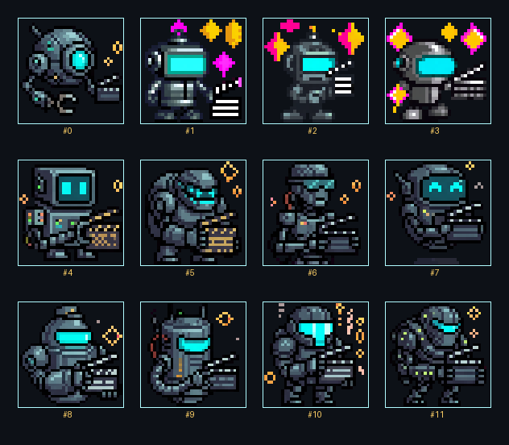
</p>

<table>
  <tr>
    <td width="25%" align="center" valign="top">
      <br>
      <strong>Lead Director</strong><br>
      <sub><code>motion-director</code><br>Master creative direction, art notes, and timeline flow.</sub>
    </td>
    <td width="25%" align="center" valign="top">
      <br>
      <strong>Camera Drone</strong><br>
      <sub><code>title-sequence-3d</code><br>Cinematic orbits, camera tracking, and depth sweeps.</sub>
    </td>
    <td width="25%" align="center" valign="top">
      <br>
      <strong>Terminal Rig</strong><br>
      <sub><code>brand-intake</code><br>Code foundations, design tokens, and motion config.</sub>
    </td>
    <td width="25%" align="center" valign="top">
      <br>
      <strong>Social Spark</strong><br>
      <sub><code>reel-export</code><br>Vertical cuts, looping covers, and viral promos.</sub>
    </td>
  </tr>
</table>

Explore the full 12-sprite pixel catalog and manifests in [`assets/sprites/`](assets/sprites/).

## Contributing

Found a way to improve a skill? [Open an issue](https://github.com/imMamdouhaboammar/motion-graphics-skills/issues).

Before debugging a render, a clipped word or a broken transition, check [Failure-lessons](Failure-lessons/lessons-index.md). It records what already went wrong on real films, how it was proven, and the rule that now prevents it.

Run `bash validate-skills.sh` before you submit. It checks every skill's frontmatter, that the name matches the folder, the description length, and the house style across every skill, its reference files and the prompts folder.

## Author and Ownership

<table>
  <tr>
    <td valign="top">
      <strong>Mamdouh Aboammar</strong><br>
      <sub>AI Engineer and Creative Technologist</sub><br>
      <a href="https://github.com/imMamdouhaboammar">GitHub Profile</a>
    </td>
  </tr>
</table>

## Licence

[Proprietary (All Rights Reserved)](LICENSE). Copyright (c) 2026 Mamdouh Aboammar. All rights reserved. Strictly prohibited to copy, distribute, modify, reverse engineer, or commercially exploit without explicit written permission.
