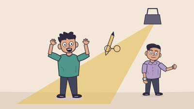

# متلبس بالشطارة | Metlebes Bel Shatara

An original Egyptian Arabic satirical 2D short about a professional caught being good at the job. SVG character rigs and GSAP animation, produced with HyperFrames. The supplied narration is preserved in full.

[](renders/Metlebes_Bel_Shatara_Final.mp4)

[Watch / download the full MP4](renders/Metlebes_Bel_Shatara_Final.mp4) · [Full audio animatic](renders/Metlebes_Animatic.mp4)

1920 × 1080 · 30fps · 112.300 seconds · H.264 / AAC

The committed MP4 is a smaller CRF24 viewing encode of the delivered master. All 3369 frames and the full duration are preserved; the AAC audio stream is copied without re-encoding. The original delivered master is 18,734,065 bytes; this repository edition is 6,047,946 bytes.

## Editable source

`runtime/index.html` is the authoritative composition: original SVG scene art, inline GSAP choreography, timed scenes and three audio tracks. `runtime/animation.js` is a timeline reference; edit the inline timeline for final changes. Neutral scene SVG assets and front/quarter/rear character model sheets are in `runtime/assets/`. Final placement and structural corrections are in `index.html`. This is an HTML/SVG animation project, not an After Effects project.

```bash
cd projects/metlebes-bel-shatara/runtime
npm install
npm run dev
npm run check
npm run render -- --fps 30 --quality delivery -o ../renders/Metlebes_Bel_Shatara_Final.mp4
```

The CLI is pinned to HyperFrames 0.8.111. FFmpeg and compatible Chromium are required. Let HyperFrames provision its browser, or set `HYPERFRAMES_BROWSER_PATH` to an installed executable. No browser binary or node_modules are committed.

## Story and production evidence

- [Timecoded 16-beat storyboard](docs/Storyboard_Timecoded.md)
- [Timed script reference and transcript limits](docs/Transcript_Timed.md)
- [Production model sheet](docs/character-model-sheet-production.png)
- [Visual styleframes](docs/film-styleframes-contact-sheet.png)
- [Frames from the final render](docs/final-film-contact.jpg)
- [QA report and review limitations](docs/QA_Report.md)

## Motion proofs

[Contradictory logo brief](proofs/proof04.mp4) · [Theatrical arrest](proofs/proof09.mp4) · [Nighttime return to work](proofs/proof13.mp4) · [Final coin gag](proofs/proof16.mp4)

Proof HTML projects are under `runtime/proofs/`. Excerpts are used only in these proofs. The main film plays the full original recording from zero, including the exact closing punchline about «اتنين جنيه ونص».

## Audio and QA scripts

`runtime/assets/narration-original.wav` is byte-identical to the supplied recording. Original music and SFX are separate WAVs. No third-party stock recordings were used. `scripts/compose_audio.py` reproduces the procedural music and SFX. Its reference mix does not include HyperFrames' final additional music carve. `scripts/final_qa.py` samples the actual MP4 and checks source/output audio correlation. Install `scripts/requirements.txt` to run Python scripts.

Quantitative export and dialogue-integrity checks passed. Visual inspection used sampled final-video frames and temporal proof sequences. Full sound-on human playback and word-by-word listening certification were not performed. See the QA report for the remaining limits. Several scene transitions are direct cuts and the rigs use held poses.

Original art, narration and film © 2026 Mamdouh Aboammar. Repository license applies to this project. Third-party runtime libraries retain their own licenses.
